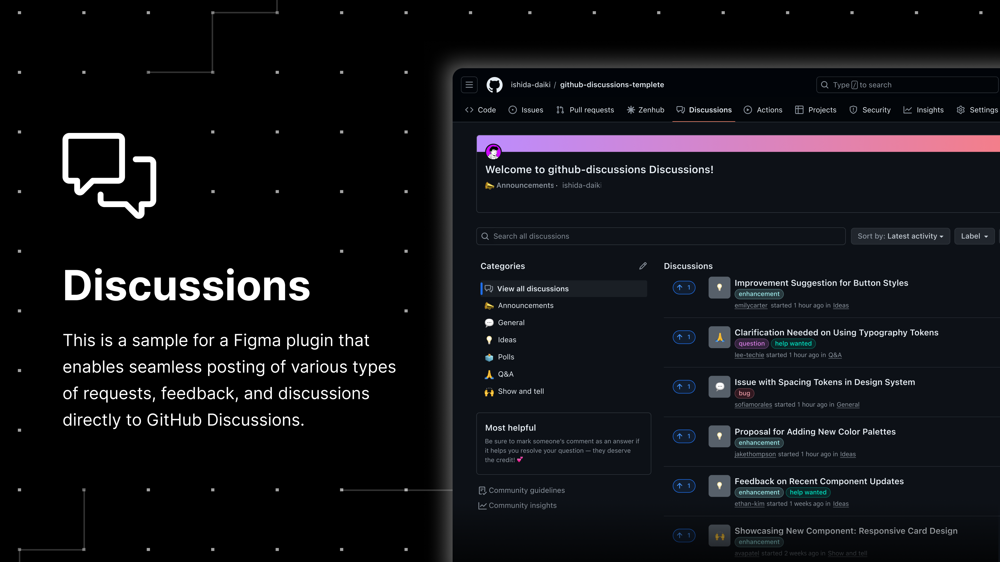

<div align="center">
  <h1>github-discussions-templete</h1>
  <p>
    github-discussions-templete は、Figma のプラグインを使って GitHub Discussions に直接投稿できる Figma プラグインのテンプレートプロジェクトです。コードをカスタマイズして、チームのワークフローに合わせてご利用ください。
  </p>
  <br>
  <div>
    
    
    
  </div>
  <br>
  <div>
    <a href="https://opensource.org/licenses/MIT">
      
    </a>
  </div>
  <br>
  
</div>

## Table of contents

- [Figma Sample Plugin](#figma-sample-plugin)
- [Features](#features)
- [Usecase](#usecase)
- [Benefits](#benefits)
- [Intended Use](#intended-use)
- [Settings](#settings)
  - [開発環境の設定](#開発環境の設定)
  - [Personal Access Token の作成](#Personal-Access-Token-の作成)
- [Build](#build)
  - [プラグインをビルドするコマンド](#プラグインをビルドするコマンド)
  - [プラグインを自動的に再ビルドするコマンド](#プラグインを自動的に再ビルドするコマンド)
- [Plugin Security Notice](#Plugin-Security-Notice)
- [Credits](#credits)
- [Appendix](#Appendix)


<div align="center">
  <h2>Figma Sample Plugin</h2>
  <p>このプラグインは、<code>github-discussions-templete</code> をビルドしたプライベートプラグインです。</p>
  <br>

[](https://www.figma.com/developers) [](https://help.figma.com/hc/en-us/articles/4404228629655-Create-private-organization-plugins)

</div>

 
開発環境を設定する前にプラグインの動作を確認したい場合は、次の手順を試してみてください：

1. [Discussions](https://www.figma.com/community/plugin/1402940367964187567/github-discussions-sample) にアクセス。
2. "Open in..." を押下。

> [!NOTE]
> <code>DMM.com LLC</code> 組織内のメンバーのみ利用可能です。

<h2 align="center">Features</h2>

- **シームレスな投稿**: `Figma Design` や `FigJam`、`Dev Mode` から直接 GitHub Discussions にリクエスト、フィードバック、ディスカッションしたい内容を投稿できます。
  - 投稿内容には、選択した Figma の要素リンク、タイトル、内容、ラベル、画像を添付して送ることができます。また、送信した人の名前も送付されるため、誰がどんな内容を投稿したのかが一目でわかります。
  - *投稿例:* デザイン要素のスクリーンショットや、フィードバックの詳細などをGitHub Discussionsにシームレスに投稿できます。

- **動作確認**: Submit ボタンを押すと、.env ファイルに設定した GitHub Discussions に投稿されます。

<h2 align="center">Usecase</h2>

- **デザイナー向け**: 
  - Figma 組織内で、一つのデザインシステムを使い、複数のプロジェクトを作成している場合、デザイナーは、デザインシステムを使いながら、フィードバックや質問、要望を Figma ツールから離脱せずにデザインシステム開発チームに投稿することができます。
  - 具体例: デザイン作業中に疑問や改善点が発生した際、その場でスクリーンショットや具体的な質問内容を添付してポストできるため、作業の流れを妨げることなくフィードバックを送ることができます。

- **エンジニア向け**:
  - エンジニアも、開発時に感じた質問や、デザインシステムの仕様に関する疑問、根本的な問題点を Figma ツールから離脱せずに投稿することができます。
  - 具体例: コーディング中にデザインシステムのコンポーネントに関する疑問が生じた場合、迅速に質問を投稿し、早期に解決することができます。

<h2 align="center">Benefits</h2>

- **意見の集約と管理**:
  - デザインシステムに関する利用者からの意見を一箇所に集約して管理することができます。これにより、過去のフィードバックや質問を簡単に見返すことができ、対応履歴を一目で把握できます。
  
- **ナレッジシェアリング**:
  - 新しいメンバーがプロジェクトに参加した際に、過去に行われた意思決定や問い合わせの内容を確認することができるため、スムーズにプロジェクトに入っていくことができます。この情報は、これからの設計や開発に一貫性を持たせる上でも役立ちます。

- **効率化**:
  - 使用者が Figma ツールから離れずにフィードバックを送信できるため、ツール間の移動による時間のロスがなくなり、作業効率が向上します。リアルタイムでのフィードバックのやり取りにより、問題の早期発見と解決が可能になります。

<h2 align="center">Intended Use</h2>

このツールは、デザインや開発に関わるさまざまな意見を集約し、[Figma Community Forum](https://forum.figma.com/) のように利用されることを想定しています。デザインシステムに関する議論を一箇所に集め、より効果的なコラボレーションを促進します。


<h2 align="center">Settings</h2>

#### 開発環境の設定

1. 「Use this template」を押下し、「Create a new repository」を選択して、新しいリポジトリを作成。
2. 新しく作成したリポジトリをクローン。
3. クローンしたリポジトリに移動。
4. 必要なパッケージをインストール:

```cli
npm install
```

5. VS Code を開く:

```cli
code .
```

6. ルートディレクトリに `.env` ファイルを作成し、以下の値を設定:

```.env
例 ishida-daiki / github-discussions-templete の場合:

GITHUB_OWNER=ishida-daiki
GITHUB_REPO=github-discussions-templete
GITHUB_ACCESS_TOKEN=#ここに新しく作成した GitHub Personal access token を設定してください。
```

> [!IMPORTANT]
> `.env` ファイルの `GITHUB_ACCESS_TOKEN` に `Personal access token` が設定されていない場合、GitHub Discussions の情報取得や、GitHub Discussions へのポストができません。<br />
> Personal access token を生成後、必ず `.env` ファイルの `GITHUB_ACCESS_TOKEN` に設定してください。
>
> Personal access token の作成方法については、[Personal Access Token の作成](#Personal-Access-Token-の作成) をご参照ください。

7. 🎉 開発環境の設定が完了しました！開発を開始する際には、[Build](#build) をご確認ください。

#### Personal Access Token の作成

1. GitHub にログインし、https://github.com/settings/tokens を押下。
2. 「Generate new token」を押下し、`Generate new token (classic)` を選択。
3. 「Expiration」を `No expiration` に設定。
4. 「Select scopes」セクションで、`repo` と `write:discussion` のチェックボックスを選択。
5. 「Generate token」を押下。
6. 生成されたトークンをコピーし、`.env` ファイル内の `GITHUB_ACCESS_TOKEN` に設定。
> [!WARNING]
> 複数の `GITHUB_ACCESS_TOKEN` を作成するのではなく、単一のトークンを生成し、チーム内で共有することをお勧めします。


<h2 align="center">Build</h2>

#### プラグインをビルドするコマンド

```cli
npm run build
```

このコマンドを実行すると、[`manifest.json`](https://figma.com/plugin-docs/manifest/) ファイルと、プラグインの JavaScript バンドルを含む `build/` ディレクトリが生成されます。

#### プラグインを自動的に再ビルドするコマンド

```cli
npm run watch
```

このコマンドはソースコードの変更を監視し、更新が検出されるとプラグインを自動的に再ビルドします。


<h2 align="center">Plugin Security Notice</h2>

もともと、`figma.clientStorage` を使用してユーザーのローカルマシンにデータを保存し、GitHub Discussions に投稿するプラグインを作成する予定でした。しかし、公式の Figma ドキュメントでは次のように述べられています:

> ⚠ The data is stored privately for stability, not security. It prevents other plugins from accessing with your data. It does not, however, prevent users from seeing data stored on their own client given sufficient effort.

[figma.clientStorage](https://www.figma.com/plugin-docs/api/figma-clientStorage/#:~:text=%E2%9A%A0%20The%20data%20is%20stored%20privately%20for%20stability%2C%20not%20security.%20It%20prevents%20other%20plugins%20from%20accessing%20with%20your%20data.%20It%20does%20not%2C%20however%2C%20prevent%20users%20from%20seeing%20data%20stored%20on%20their%20own%20client%20given%20sufficient%20effort.)

この説明を考慮して、アクセストークンなどのデータを保存するにはリスクがあると判断しました。したがって、このプラグインをテンプレートとして提供します。プラグインは、公開プラグインではなく、プライベートまたは組織専用のプラグインとして、自分の環境でビルドしてご使用ください。


<h2 align="center">Credits</h2>

このプロジェクトは、Yuan Qing Lim さんが提供している [create-figma-plugin](https://github.com/yuanqing/create-figma-plugin) をベースにして開発しました。元のソースコードを使用し、新しい MIT ライセンスの下で新しいテンプレートとして提供しています。新しい MIT ライセンスの全文については、このリポジトリ内の LICENSE ファイルをご参照ください。


<h2 align="center">Appendix</h2>

- [Create Figma Plugin docs](https://yuanqing.github.io/create-figma-plugin/)
- [`yuanqing/figma-plugins`](https://github.com/yuanqing/figma-plugins#readme)

公式 Figma ドキュメントおよびコードサンプル:

- [Plugin API docs](https://figma.com/plugin-docs/)
- [`figma/plugin-samples`](https://github.com/figma/plugin-samples#readme)
